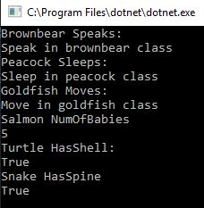
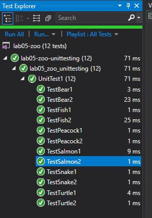

# Zoo

We were asked to diagram a zoo of animal classes and show their relations and clarify their properties and methods. Then to code said classes.
We were asked to meet the following requirements:
- Have at least 3 different abstract classes
- Have at least 3 layers of inheritance
- Have at least 5 concrete animals
- Have at least 2 abstract methods (make sure you override them)
- Have at least 2 abstract Properties (make sure you override them)
- Have at least 2 virtual methods (make sure you override at least one of them)
- Have at least 2 virtual properties (make sure you override at least one of them)

## Solution

My classes are based on this diagram

This is what the program would look like

Proof passed tests

## Contribution

# Technical Documentation

## OOP Principles 1: Inheritance
### Inheritance is where a derived class takes on the properties and methods of the base call it was derived from.
#### In my diagram/example, one could see this principle in all classes under Vertebrates, like Mammal and Fish.

## OOP Principles 2: Abstraction
### Abstraction is like hiding a class because it was a base class. It help protect its template that it creates for derived classes. 
#### In my diagram/example, one could see this principle in all the base classes, like Bird and Reptile.

## OOP Principles 3: Polymorphism
### Polymorphism is a flexible way to use classes. It allows one to write properties and methods that can be declared in the base class and passed on to derived classes (via virtual) while it also allows derived classes to override the property/method if it doesn't like the one from the base class. 
#### In my diagram/example, one could see this principle in Vertebrates.HasSpine, where it was defined in the base class, however any class below COULD have overridden it, or Mammal and BrownBear with Birth, where it was defined in Mammal and then overwritten in BrownBear.

## OOP Principles 4: Encapsulation
### Encapsulation is access control. It can prevent another class from accessing/manipulating that class's data.
#### In my diagram/example, one could see this principle in that all are public, like BrownBear and Goldfish. (mostly because for this assignment they are needed to be public. It is possible we could have added protected to a base class) 

